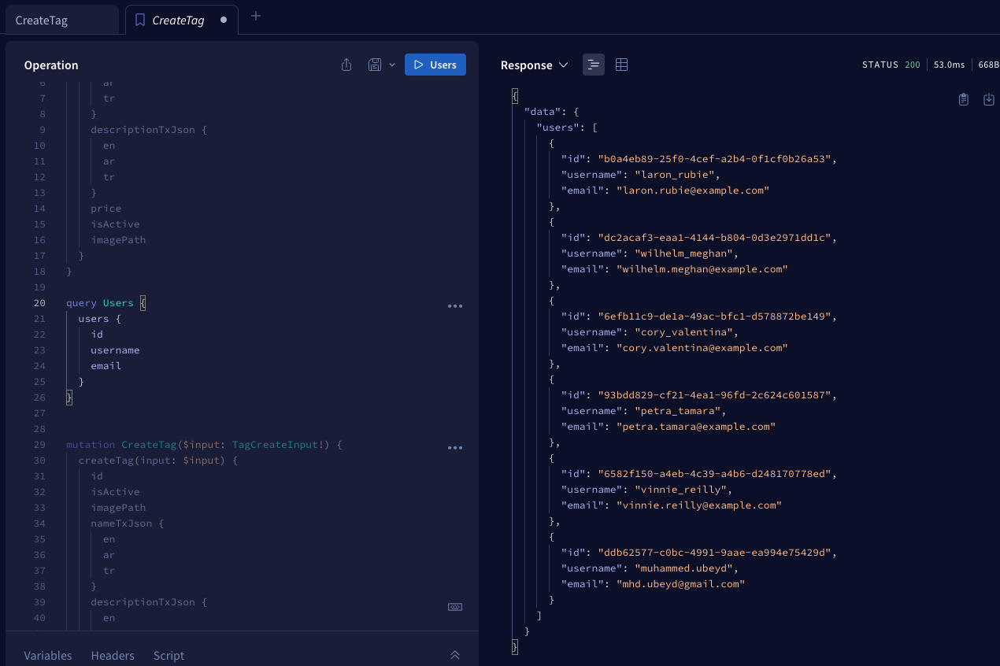

## GraphQL API with Fastify, Prisma, and PostgreSQL

This documentation guides you through setting up and running a GraphQL API using Fastify as the framework, Prisma as the ORM, and PostgreSQL as the database. The provided repository already contains the necessary codebase.


### Technologies Used

-  Fastify is a fast and low overhead web framework for Node.js

-  GraphQL is a query language for APIs

-  PostgreSQL is a powerful, open source object-relational database system

-  Prisma is a modern database toolkit

### Prerequisites

Before you start, ensure you have the following installed:

- Node.js and npm
- Yarn
- PostgreSQL

### Getting Started

1. **Clone the Repository:**

   ```sh
   git clone git@github.com:Mubeyd/graphQlApiPostgres.git
   cd graphQlApiPostgres
   ```

   

2. **Install Dependencies:**

   ```sh
   yarn install
   ```

3. **Configure the Database:**

   - Create a PostgreSQL database.
   - Rename the `.env.example` file to `.env` and fill in your database connection details.

4. **Migrate Database:**

   Run Prisma migrations to create the database tables:

   ```sh
   npx prisma migrate dev
   ```

### Running the GraphQL Server

1. **Start the Server:**

   ```sh
   yarn dev
   ```

2. **Access GraphQL Playground:**

   Open your browser and navigate to `http://localhost:4000/graphql`.

### Performing Queries and Mutations

1. **GraphQL Playground:**

   In the GraphQL Playground, you can write and test your queries and mutations against the defined schema.

   Example Query:
   ```graphql
    query Users {
        users {
            id
            username
            email
        }
    }
   ```

   Example Mutation:
   ```graphql
   mutation CreateTag($input: TagCreateInput!) {
    createTag(input: $input) {
        id
        isActive
        imagePath
        nameTxJson {
            en
            ar
            tr
        }
        descriptionTxJson {
            en
            ar
            tr
        }
      }
    }
   ```

2. **Explore API:**

   Explore the available queries, mutations, and their documentation in the right sidebar of the GraphQL Playground.


### Using Caddy Server
The GraphQL API is exposed through Caddy, acting as a reverse proxy. No additional setup is required for Caddy, as it's already configured in the `Docker Compose` file, and the necessary configuration files are already provided in the `Caddyfile` directory.


### Conclusion

You've successfully set up and run a GraphQL API using Fastify, Prisma, and PostgreSQL. The provided repository contains a functional codebase that you can extend and customize to build more complex GraphQL APIs according to your project requirements. Happy coding! 🚀


# App Screenshots

<div style="display: flex; margin: 12px;">
  <div style="flex: 1; margin-right: 12px;">
    <p>Screenshot </p>
    
  </div>
</div>


--------------------

